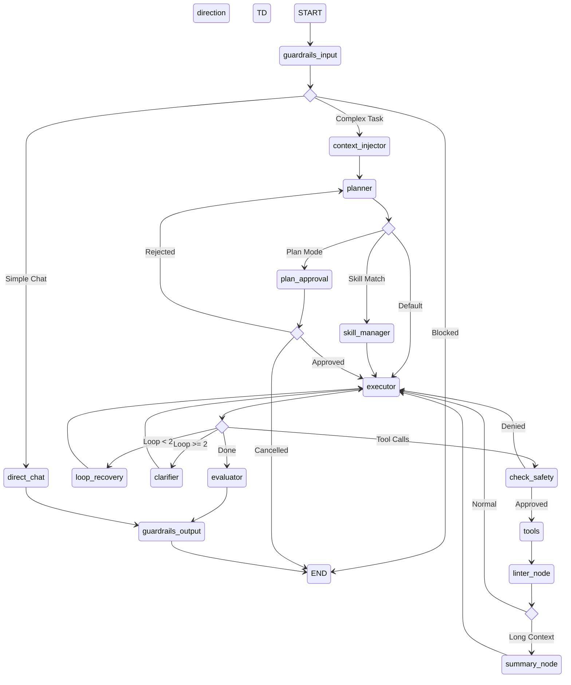

# 🧭 Compass — AI Coding Agent

Compass is a fully autonomous AI coding agent that can read, write, debug, and refactor entire codebases on your behalf. It ships with three interfaces — a feature-rich **Terminal UI (TUI)**, a modern **Web Application**, and a **VS Code Extension** — all powered by a shared LangGraph agent backend.

---

## Table of Contents

- [Features](#features)
- [Architecture Overview](#architecture-overview)
- [Project Structure](#project-structure)
- [Agent Core (`agent/`)](#agent-core)
- [Backend API (`backend/`)](#backend-api)
- [Frontend Web UI (`frontend/`)](#frontend-web-ui)
- [Terminal UI (TUI)](#terminal-ui-tui)
- [VS Code Extension (`vscode-extension/`)](#vs-code-extension)
- [Evaluation Suite (`evals/`)](#evaluation-suite)
- [Built-in Tools](#built-in-tools)
- [Safety & Guardrails](#safety--guardrails)
- [Model Context Protocol (MCP)](#model-context-protocol-mcp)
- [Skills System](#skills-system)
- [Configuration](#configuration)
- [Getting Started](#getting-started)
- [Deployment](#deployment)
- [Environment Variables](#environment-variables)
- [License](#license)

---

## Features

| Category | Details |
|---|---|
| **Multi-Interface** | Terminal UI (Rich + prompt_toolkit), Web App (React + Vite), VS Code Extension |
| **Agent Architecture** | Multi-node LangGraph state machine: Planner → Executor → Safety → Tools → Recovery → Summarizer |
| **12 Built-in Tools** | File I/O, directory listing, grep, semantic codebase search, shell execution, web search, memory, todos, skill creation |
| **MCP Integration** | Dynamically load external tools from any Model Context Protocol server (GitHub, databases, etc.) |
| **Human-in-the-Loop** | Risky operations (shell commands, file writes) require explicit user approval with Yes / No / Always / Skip options |
| **Fast Mode** | Global or per-query toggle to bypass all safety checks and HITL approvals for maximum speed |
| **RAG Pipeline** | Automatic codebase indexing with ChromaDB for semantic search across your project |
| **Loop Detection** | Detects when the agent repeats identical tool calls and auto-recovers with a dedicated Recovery Agent |
| **LLMOps** | LangSmith tracing, per-node token tracking, cost estimation, and structured logging with `structlog` |
| **NeMo Guardrails** | Input/output content filtering powered by NVIDIA NeMo Guardrails |
| **Skills** | Modular, reusable sub-agents that can be loaded from YAML definitions and invoked dynamically |
| **Session Management** | Persistent sessions with PostgreSQL-backed checkpointing, resumable across restarts |
| **OAuth & JWT Auth** | Google OAuth login, JWT access/refresh tokens, rate limiting |
| **Docker Ready** | Full `docker-compose.yml` and `docker-compose.prod.yml` for one-command deployment |
| **Evaluations** | LangSmith-powered eval suite with answer relevance, hallucination, and tool correctness evaluators |

---

## Architecture Overview

```
┌─────────────────────────────────────────────────────────────────┐
│                        User Interfaces                          │
│  ┌──────────┐    ┌──────────────┐    ┌───────────────────────┐  │
│  │   TUI    │    │   Web App    │    │  VS Code Extension    │  │
│  │ (Rich +  │    │ (React +     │    │  (Webview sidebar)    │  │
│  │  Click)  │    │  Vite)       │    │                       │  │
│  └────┬─────┘    └──────┬───────┘    └───────────┬───────────┘  │
│       │                 │                        │              │
│       │    ┌────────────▼────────────┐           │              │
│       │    │   FastAPI Backend       │◄──────────┘              │
│       │    │  (REST + WebSocket)     │                          │
│       │    └────────────┬────────────┘                          │
│       │                 │                                       │
│       ▼                 ▼                                       │
│  ┌──────────────────────────────────────────────────────────┐   │
│  │              LangGraph Agent Core                        │   │
│  │  ┌─────────┐  ┌──────────┐  ┌────────┐  ┌───────────┐  │   │
│  │  │ Planner │→ │ Executor │→ │ Safety │→ │   Tools   │  │   │
│  │  └─────────┘  └──────────┘  └────────┘  └───────────┘  │   │
│  │  ┌──────────┐  ┌────────────┐  ┌─────────────────────┐  │   │
│  │  │ Recovery │  │ Summarizer │  │ Guardrails (NeMo)   │  │   │
│  │  └──────────┘  └────────────┘  └─────────────────────┘  │   │
│  └──────────────────────────────────────────────────────────┘   │
│                              │                                  │
│              ┌───────────────┼───────────────┐                  │
│              ▼               ▼               ▼                  │
│         PostgreSQL      ChromaDB        MCP Servers             │
│        (Sessions)     (RAG Index)     (External Tools)          │
└─────────────────────────────────────────────────────────────────┘
```

---

## Project Structure

```
compass/
├── main.py                        # CLI entry point (TUI launcher)
├── requirements.txt               # Python dependencies
├── pyproject.toml                 # Python project metadata
├── alembic.ini                    # Database migration config
├── docker-compose.yml             # Dev Docker stack
├── docker-compose.prod.yml        # Production Docker stack
├── backend.Dockerfile             # Backend container
├── frontend.Dockerfile            # Frontend container
├── DEPLOYMENT.md                  # Production deployment guide
│
├── agent/                         # 🧠 Agent Core (LangGraph)
│   ├── config.py                  #   Settings manager (TOML-based)
│   ├── llm.py                     #   Role-based LLM factory
│   ├── safety.py                  #   Tool safety classification & HITL logic
│   ├── mcp.py                     #   MCP client for external tool servers
│   ├── loop_detector.py           #   Repeated tool-call detection
│   ├── sessions.py                #   Local session management (SQLite)
│   ├── telemetry.py               #   Token tracking & LangSmith tracing
│   ├── graph/
│   │   ├── state.py               #     AgentState TypedDict definition
│   │   ├── nodes.py               #     All graph node functions
│   │   ├── workflow.py            #     StateGraph assembly & routing
│   │   ├── tools_registry.py      #     Central tool list
│   │   └── remote_tool_node.py    #     Edge relay tool execution
│   ├── guardrails/
│   │   ├── engine.py              #     NeMo Guardrails wrapper
│   │   ├── config.yml             #     Guardrails rail definitions
│   │   └── rails.co               #     Colang safety rules
│   ├── tools/
│   │   ├── file_tools.py          #     read_file, write_to_file, edit_file
│   │   ├── directory_tools.py     #     list_dir, find_files
│   │   ├── search_tools.py        #     grep_search
│   │   ├── shell_tool.py          #     shell_execute (sandboxed)
│   │   ├── web_tools.py           #     web_search (DuckDuckGo)
│   │   ├── memory_tool.py         #     Persistent key-value memory store
│   │   ├── todo_tool.py           #     Task list management
│   │   ├── change_tracker.py      #     File change history & undo support
│   │   ├── create_skill_tool.py   #     Dynamically create new skills
│   │   ├── discovery.py           #     Auto-discover custom tools
│   │   └── utils.py               #     Shared tool utilities
│   ├── rag/
│   │   ├── indexer.py             #     Codebase indexing pipeline
│   │   ├── retriever.py           #     Semantic search retriever
│   │   ├── chunker.py             #     Text chunking strategies
│   │   ├── loaders.py             #     File type loaders
│   │   ├── uploads.py             #     User file upload processing
│   │   └── vector_store.py        #     ChromaDB vector store wrapper
│   ├── skills/
│   │   ├── models.py              #     Skill data models
│   │   ├── loader.py              #     YAML skill loader
│   │   ├── registry.py            #     Skill discovery & registration
│   │   ├── manager.py             #     SkillManagerAgent orchestration
│   │   └── subagent_factory.py    #     Spawn isolated sub-agents per skill
│   └── ui/
│       ├── tui.py                 #     Full terminal UI (2400+ lines)
│       ├── diff_renderer.py       #     Rich-powered unified diff display
│       └── relay.py               #     WebSocket relay for edge execution
│
├── backend/                       # 🌐 FastAPI Web Backend
│   ├── main.py                    #   App entry point, middleware, lifespan
│   ├── config.py                  #   Pydantic settings (env-based)
│   ├── db.py                      #   SQLAlchemy engine & session
│   ├── auth/
│   │   ├── jwt.py                 #     JWT token creation & verification
│   │   ├── oauth.py               #     Google & GitHub OAuth flows
│   │   ├── passwords.py           #     Bcrypt password hashing
│   │   └── dependencies.py        #     FastAPI auth dependency injection
│   ├── models/
│   │   ├── user.py                #     User SQLAlchemy model
│   │   ├── session.py             #     ChatSession model
│   │   ├── message.py             #     Message model
│   │   ├── run.py                 #     AgentRun model (status tracking)
│   │   ├── workspace.py           #     Workspace model
│   │   ├── patch.py               #     Code patch model (diffs)
│   │   └── upload.py              #     File upload model
│   ├── routers/
│   │   ├── auth.py                #     Login, register, OAuth, token refresh
│   │   ├── chat.py                #     WebSocket streaming & HTTP fallback
│   │   ├── sessions.py            #     CRUD for chat sessions
│   │   ├── core.py                #     Settings, MCP config, runs
│   │   ├── uploads.py             #     File upload & indexing endpoints
│   │   └── workspaces.py          #     Workspace & patch management
│   ├── services/
│   │   ├── agent_runner.py        #     LangGraph ↔ FastAPI bridge (streaming)
│   │   ├── session_manager.py     #     Session lifecycle management
│   │   ├── run_manager.py         #     Run cancellation signals
│   │   ├── patch_manager.py       #     Diff generation & patch application
│   │   └── workspace.py           #     Workspace directory operations
│   ├── schemas/
│   │   ├── auth.py                #     Auth request/response schemas
│   │   ├── chat.py                #     Chat & streaming schemas
│   │   ├── session.py             #     Session schemas
│   │   └── upload.py              #     Upload schemas
│   ├── middleware/
│   │   ├── logging.py             #     Structured request logging
│   │   └── rate_limit.py          #     IP-based rate limiting
│   └── ws/
│       └── hub.py                 #     WebSocket connection manager
│
├── frontend/                      # 💻 React Web UI
│   ├── package.json               #   Dependencies & scripts
│   └── src/
│       ├── App.tsx                 #     Router & layout shell
│       ├── api.ts                  #     Axios API client (all endpoints)
│       ├── index.css               #     Global theme, scrollbars, animations
│       ├── main.tsx                #     React DOM entry point
│       ├── pages/
│       │   ├── ChatPage.tsx        #       Main IDE layout (Allotment panes)
│       │   ├── LoginPage.tsx       #       Login/register page
│       │   └── AuthCallback.tsx    #       OAuth redirect handler
│       ├── components/
│       │   ├── layout/
│       │   │   └── AppLayout.tsx   #         Sidebar + header + routing
│       │   ├── chat/
│       │   │   ├── ChatInput.tsx   #         Message input + mode selector
│       │   │   ├── MessageList.tsx #         Message rendering + empty state
│       │   │   ├── MarkdownMessage.tsx #     Markdown + syntax highlighting
│       │   │   ├── ToolCallCard.tsx #        Collapsible tool invocation card
│       │   │   ├── ThinkingBlock.tsx #       Chain-of-thought display
│       │   │   ├── PlanChecklist.tsx #       Step-by-step plan renderer
│       │   │   ├── RunTimeline.tsx  #        Live agent run event log
│       │   │   ├── ShimmerLoader.tsx #       Skeleton loading animation
│       │   │   └── MessageSkeleton.tsx #    Full message skeleton
│       │   ├── sandbox/
│       │   │   ├── CodeSandbox.tsx  #        File explorer + editor + diffs
│       │   │   ├── CodeMirrorEditor.tsx #   CodeMirror 6 wrapper
│       │   │   ├── WebPreview.tsx       #   WebContainer preview & terminal
│       │   │   ├── FileExplorer.tsx #       Recursive file tree
│       │   │   ├── DiffReviewPanel.tsx #    Side-by-side diff viewer
│       │   │   ├── WorkspaceHeader.tsx #    Workspace status bar
│       │   │   └── WorkspaceLanding.tsx #   Create/connect workspace
│       │   ├── settings/
│       │   │   ├── SettingsModal.tsx #      Full settings panel
│       │   │   ├── McpServerManager.tsx #   Visual MCP server editor
│       │   │   └── SkillsManager.tsx    #   Custom agent skill builder
│       │   ├── auth/
│       │   │   ├── LoginModal.tsx   #       Auth modal (email + OAuth)
│       │   │   └── ProtectedRoute.tsx #    Route guard
│       │   └── ui/                  #       Shared primitives (Button, Card, etc.)
│       └── contexts/
│           └── RunContext.tsx       #       Global agent run state
│
├── vscode-extension/              # 🔌 VS Code Extension
│   ├── package.json               #   Extension manifest & commands
│   ├── src/                       #   Extension host (TypeScript)
│   └── webview/                   #   Sidebar webview UI
│
└── evals/                         # 🧪 Evaluation Suite
    ├── run_evals.py               #   LangSmith evaluation runner
    ├── evaluators.py              #   Custom evaluators (relevance, hallucination, tool correctness)
    └── golden_dataset.json        #   Test cases with expected outputs
```

---

## Agent Core



### Key Nodes

| Node | File | Purpose |
|---|---|---|
| `guardrails_input_node` | `nodes.py` | Runs NeMo Guardrails input validation. Blocks prompt injection and unsafe content. |
| `direct_chat_node` | `nodes.py` | Fast-path for simple conversational greetings without engaging tools or complex planning. |
| `context_injector_node` | `nodes.py` | Injects RAG context, long-term memory, and workspace metadata into the conversation. |
| `planner_node` | `nodes.py` | Analyzes the user request and outputs a numbered step-by-step plan. Detects skill matches. |
| `plan_approval_node` | `nodes.py` | Halts execution to request explicit user approval for generated plans before proceeding. |
| `skill_manager` | `manager.py` | Orchestrates skill execution by delegating to a specialized SubAgentFactory based on the active skill. |
| `call_model` (Executor) | `nodes.py` | Invokes the LLM with all available tools bound. Tracks token usage and loop patterns. |
| `check_safety_node` | `nodes.py` | Classifies pending tool calls as safe or risky. Risky calls trigger a LangGraph `interrupt()` for user approval. |
| `linter_node` | `nodes.py` | Runs basic lint checks on generated code immediately after tools run. |
| `summary_node` | `nodes.py` | Compacts long conversation histories to stay within context limits. |
| `loop_recovery_node` | `nodes.py` | A separate LLM analyzes why the executor is stuck in a tool-calling loop and provides corrective guidance. |
| `clarifier_node` | `nodes.py` | After repeated loop failures (2+), asks the user a clarifying question instead of retrying endlessly. |
| `evaluator_node` | `nodes.py` | Post-execution quality check using a separate LLM to verify the response meets the user's intent. |
| `guardrails_output_node` | `nodes.py` | Runs NeMo Guardrails output validation before sending the final response to the user. |
| `title_generator_node` | `nodes.py` | Asynchronously generates a short title for new sessions (fire-and-forget). |

### AgentState

The shared state (`agent/graph/state.py`) includes:

- `messages` — Full conversation history (with LangGraph's `add_messages` reducer)
- `plan` / `current_step` — The active plan and which step the executor is on
- `loop_detected` / `loop_count` / `recovery_guidance` — Loop recovery state
- `pending_tool_calls` / `approval_status` — HITL approval flow
- `active_skill` / `skill_result` — Skill sub-agent delegation
- `guardrails_input_result` / `guardrails_output_result` — Safety gate results
- `hitl_session_approvals` / `hitl_skip_count` — Cached "Always Yes" patterns

---

## Backend API

The FastAPI backend (`backend/`) exposes REST and WebSocket endpoints for the Web UI and VS Code Extension.

### Key Endpoints

| Method | Path | Purpose |
|---|---|---|
| `POST` | `/auth/register` | Create a new account |
| `POST` | `/auth/login` | Email + password login |
| `GET` | `/auth/google` | OAuth redirect flow |
| `POST` | `/auth/refresh` | Refresh JWT access token |
| `GET/POST` | `/sessions` | List and create chat sessions |
| `WebSocket` | `/chat/ws/{session_id}` | Real-time streaming (tokens, tool calls, approvals) |
| `POST` | `/chat/{session_id}/send` | HTTP fallback for non-WebSocket clients |
| `GET/PUT` | `/settings` | User preferences (model, theme, fast mode) |
| `GET/POST` | `/settings/mcp-servers` | MCP server configuration |
| `GET` | `/workspaces/{id}/patches` | List pending code patches |
| `POST` | `/workspaces/{id}/patches/{patch_id}/apply` | Apply a code diff |
| `POST` | `/uploads/{session_id}` | Upload and index files for RAG |
| `GET` | `/health` | Health check |

### Streaming Protocol

The WebSocket handler in `backend/routers/chat.py` streams structured JSON events:

```json
{ "type": "token",       "content": "Hello" }
{ "type": "tool_call",   "tool_call": { "name": "read_file", "args": {...} } }
{ "type": "tool_result", "tool_result": { "name": "read_file", "output": "..." } }
{ "type": "approval",    "approval": { "reason": "shell_execute", "options": ["yes","no","always","skip"] } }
{ "type": "plan",        "content": "1. Read the file\n2. Edit line 42\n..." }
{ "type": "done",        "content": "..." }
{ "type": "error",       "content": "..." }
```

---

## Frontend Web UI

The React frontend (`frontend/`) provides a modern IDE-like experience.

### Layout

The main `ChatPage.tsx` uses **Allotment** to create a resizable split-pane layout:

- **Left Pane** — Chat interface with message list, streaming indicators, and input bar
- **Right Pane** — CodeSandbox with file explorer, CodeMirror 6 editor, and diff review panel

### Key Components

| Component | Purpose |
|---|---|
| `ChatInput` | Multi-line input with file attachment, mode selector (Normal / Plan / Fast) |
| `MessageList` | Renders user and assistant messages with animated transitions |
| `ToolCallCard` | Collapsible card showing tool name, arguments, status, and result |
| `ThinkingBlock` | Expandable chain-of-thought reasoning display |
| `RunTimeline` | Live timeline of agent events (tool calls, tokens, errors) |
| `CodeSandbox` | Tabbed workspace with file tree, code editor, and diff review |
| `CodeMirrorEditor` | CodeMirror 6 with One Dark theme and multi-language support |
| `FileExplorer` | Recursive, collapsible file tree with file-type icons |
| `DiffReviewPanel` | Side-by-side diff viewer for pending patches |
| `SettingsModal` | Full settings panel (model, API key, provider, guardrails, fast mode) |
| `McpServerManager` | Visual form for adding/editing/testing MCP server connections |
| `AppLayout` | Sidebar navigation with project-based session grouping, new task, and settings |

### Tech Stack

- **React 19** with TypeScript
- **Vite 8** for fast dev builds
- **Tailwind CSS 4** for styling
- **CodeMirror 6** (JavaScript, Python, CSS, HTML, JSON, Markdown)
- **Allotment** for resizable split panes
- **Framer Motion** for animations
- **Axios** for API calls
- **react-toastify** for notifications
- **react-markdown** + **remark-gfm** for Markdown rendering
- **react-syntax-highlighter** for code blocks
- **react-diff-viewer-continued** for diff display

---

## Terminal UI (TUI)

The TUI (`agent/ui/tui.py`) is a full-featured terminal interface built with **Rich**, **Click**, and **prompt_toolkit**. It provides the same agent capabilities as the Web UI, directly in your terminal.

### Running the TUI

```bash
# Interactive REPL (new session)
python main.py

# Resume the last session
python main.py -r

# Resume a specific session
python main.py -s abc123

# Single-shot mode (non-interactive)
python main.py -m "Explain how the CLI works"

# Specify a workspace directory
python main.py -w /path/to/project
```

### TUI Features

- **Streaming output** — Token-by-token response rendering with Rich Markdown
- **Multi-line input** — Paste detection via prompt_toolkit; Enter sends, Shift+Enter adds a newline
- **Rich diff previews** — Every file write/edit shows a syntax-highlighted unified diff in the terminal
- **File change tracking** — Undo any file change with `/undo`, view all changes with `/diff`
- **Per-tool progress spinners** — Each tool call shows a live spinner with the tool name and arguments
- **Token & cost tracking** — View cumulative token usage and estimated cost with `/cost`
- **Session management** — `/sessions`, `/new`, `/resume`, `/rename` for managing multiple conversations
- **Codebase indexing** — `/index` to build a ChromaDB vector index for semantic search
- **Configuration** — `/config` to view and update all settings interactively
- **Diagnostics** — `/doctor` to check API keys, database connectivity, and MCP server health

### Slash Commands

| Command | Description |
|---|---|
| `/help` | Show all available commands |
| `/exit` | Exit Compass |
| `/clear` | Clear the terminal |
| `/model` | Show current model info |
| `/tools` | List all available tools |
| `/history` | Show conversation message count |
| `/sessions` | List recent sessions |
| `/new` | Start a new session |
| `/resume` | Resume a session by ID |
| `/rename` | Rename the current session |
| `/index` | Index the codebase for semantic search |
| `/compact` | Summarize and compact conversation context |
| `/config` | View or update settings |
| `/undo` | Undo the last file change |
| `/diff` | Show all file changes this session |
| `/files` | List files modified this session |
| `/cost` | Show token usage and estimated cost |
| `/init` | Generate a COMPASS.md project context file |
| `/doctor` | Diagnose configuration and connectivity |
| `/mode` | Toggle between plan and normal mode |
| `/goal` | Enable deep autonomous execution mode |
| `/workspace` | Show cwd, file count, and git branch |
| `/mcp` | List configured MCP servers and tools |

---

## VS Code Extension

The VS Code extension (`vscode-extension/`) embeds Compass as a sidebar panel inside your editor.

- **Activity Bar Icon** — Compass appears in the VS Code activity bar
- **Webview Sidebar** — A full chat interface rendered as a webview
- **Commands** — `Compass: New Session` to start a fresh conversation
- The extension communicates with the same FastAPI backend over HTTP/WebSocket

### Building the Extension

```bash
cd vscode-extension
npm install
npm run build:all    # Builds webview + bundles extension
```

---

## Evaluation Suite

The `evals/` directory contains a LangSmith-powered evaluation framework for measuring agent quality.

### Evaluators

| Evaluator | What It Measures |
|---|---|
| `answer_relevance` | Is the agent's response relevant and helpful to the user's question? |
| `hallucination` | Does the response make unverified claims without using tools to confirm? |
| `tool_correctness` | Did the agent use the expected tool for the task? |
| `safety_compliance` | Did the agent respect safety policies and avoid harmful outputs? |

### Running Evaluations

```bash
python evals/run_evals.py
```

This loads test cases from `evals/golden_dataset.json`, runs each through the agent, and reports scores to LangSmith.

---

## Built-in Tools

| Tool | Description |
|---|---|
| `read_file` | Read the contents of a file (with optional line range) |
| `write_to_file` | Create or overwrite a file |
| `edit_file` | Surgically edit specific sections of a file using search-and-replace |
| `list_dir` | List directory contents (files, sizes, subdirectories) |
| `find_files` | Find files matching a glob pattern |
| `grep_search` | Search file contents with regex patterns |
| `codebase_search` | Semantic search across the indexed codebase (RAG) |
| `web_search` | Search the web using DuckDuckGo |
| `shell_execute` | Execute shell commands (sandboxed, requires approval) |
| `memory` | Store and retrieve persistent key-value memories |
| `todo` | Manage a task checklist |
| `create_skill` | Create a new reusable skill from a YAML definition |

Tools can be extended by placing Python files in a `custom_tools/` directory — they are auto-discovered at startup.

In cloud deployments (`COMPASS_CLOUD_MODE=true`), `shell_execute` is automatically disabled for security.

---

## Safety & Guardrails

Compass implements multiple layers of safety:

1. **Tool Classification** (`agent/safety.py`) — Tools are classified as `SAFE` (read-only) or `RISKY` (writes, shell). Risky tools trigger HITL approval.
2. **Safety Modes** — Configurable via `safety.mode`:
   - `auto` — Default. Safe tools auto-execute, risky tools require approval.
   - `strict` — All tool calls require approval.
   - `yolo` — No approvals required (use with caution).
3. **NeMo Guardrails** (`agent/guardrails/`) — Input and output rails filter prompt injections and harmful content using Colang rules.
4. **Fast Mode** — Bypasses both HITL approvals and guardrails for maximum speed. Configurable globally in Settings or per-query in the chat input.
5. **Path Validation** — File operations are validated to stay within the workspace directory. System files and dotfiles are protected.
6. **Loop Detection** (`agent/loop_detector.py`) — Hashes recent tool calls and detects repetition. After 2 consecutive loops, the Clarifier node asks the user for help instead of retrying.

---

## Model Context Protocol (MCP)

Compass can dynamically load tools from external MCP servers. Configuration is stored in `.compass/mcp_servers.json`.

### Configuration Format

```json
{
  "github": {
    "command": "npx",
    "args": ["-y", "@modelcontextprotocol/server-github"],
    "env": { "GITHUB_TOKEN": "ghp_..." }
  },
  "filesystem": {
    "command": "npx",
    "args": ["-y", "@modelcontextprotocol/server-filesystem", "/path/to/dir"]
  }
}
```

MCP servers can be managed visually through the **Settings → MCP Servers** panel in the Web UI, or via the `/mcp` command in the TUI.

---

## Skills System

Skills are modular, reusable sub-agents defined in YAML. They live in the `skills/` directory and are auto-loaded at startup.

### Skill Definition Example

```yaml
name: code-review
description: Perform a thorough code review of a file or directory
system_prompt: |
  You are a senior code reviewer. Analyze the provided code for bugs,
  security issues, performance problems, and style violations.
tools:
  - read_file
  - grep_search
  - list_dir
```

The `SkillManagerAgent` detects when a user's request matches a registered skill and delegates execution to an isolated sub-agent with its own tool set and system prompt.

---

## Configuration

Compass uses a layered configuration system:

1. **Defaults** — Defined in `agent/config.py` (`DEFAULT_CONFIG`)
2. **Project-level** — `.compass/config.toml` in the workspace root
3. **Environment variables** — Override any setting
4. **Web UI Settings** — Saved to the database as user preferences

### Key Configuration Options

| Key | Default | Description |
|---|---|---|
| `model.planner` | `google/gemma-4-31b-it:free` | LLM for the planner node |
| `model.executor` | `google/gemma-4-31b-it:free` | LLM for the executor node |
| `safety.mode` | `auto` | Safety policy (`auto`, `strict`, `yolo`) |
| `guardrails.enabled` | `true` | Enable NeMo Guardrails |
| `fast_mode` | `false` | Bypass all safety checks |
| `hitl.enabled` | `true` | Enable human-in-the-loop approvals |
| `rag.auto_index` | `false` | Auto-index codebase on startup |
| `rag.chunk_size` | `1000` | Chunk size for RAG indexing |
| `context.summarize_after` | `10` | Messages before context compaction |
| `tools.shell_timeout` | `30` | Shell command timeout (seconds) |

---

## Getting Started

### Prerequisites

- Python 3.10+
- Node.js 18+
- PostgreSQL (for web mode, optional for TUI)

### Quick Start (TUI only)

```bash
git clone https://github.com/Krishiv1611/Compass.git
cd Compass
python -m venv .venv
.venv\Scripts\activate       # On Linux/Mac: source .venv/bin/activate
pip install -r requirements.txt

# Set your API key
set OPENROUTER_API_KEY=your_key_here

# Launch the TUI
python main.py
```

### Full Stack (Web UI + Backend)

```bash
# 1. Start the backend
uvicorn backend.main:app --reload

# 2. In a new terminal, start the frontend
cd frontend
npm install
npm run dev
```

Open `http://localhost:5173` in your browser.

### Docker

```bash
# Development
docker-compose up

# Production
docker-compose -f docker-compose.prod.yml up -d
```

---

## Deployment

For production deployments, see [DEPLOYMENT.md](DEPLOYMENT.md). Key requirements:

- Set `COMPASS_CLOUD_MODE=true` to disable local-only features (shell tool)
- Use a production PostgreSQL instance via `DB_URI`
- Set a strong `JWT_SECRET`
- Configure OAuth credentials for Google login
- Proxy WebSocket connections (`/chat/ws/*`) with upgrade support
- Serve the built frontend from a CDN or static host

---

## Environment Variables

| Variable | Required | Description |
|---|---|---|
| `OPENROUTER_API_KEY` | Yes | API key for OpenRouter (or your LLM provider) |
| `DB_URI` | Web mode | PostgreSQL connection string |
| `JWT_SECRET` | Web mode | Secret for JWT token signing |
| `GOOGLE_CLIENT_ID` | Optional | Google OAuth client ID |
| `GOOGLE_CLIENT_SECRET` | Optional | Google OAuth client secret |
| `COMPASS_CLOUD_MODE` | Optional | Set to `true` for hosted deployments |
| `CORS_ORIGINS` | Optional | Comma-separated allowed origins |
| `LANGCHAIN_API_KEY` | Optional | LangSmith API key for tracing |
| `LANGCHAIN_PROJECT` | Optional | LangSmith project name |
| `COMPASS_REDIS_URL` | Optional | Redis URL for LLM response caching |

---

## License

MIT License
